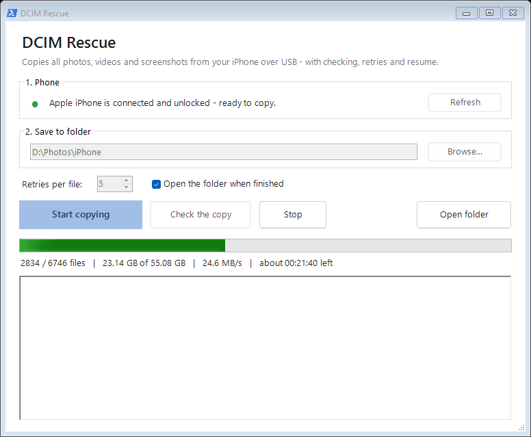

# DCIM Rescue

Copies photos, videos and screenshots from an iPhone to a Windows PC over USB, verifying each
file and retrying the ones that fail.



## Why

Importing a large iPhone library on Windows is unreliable. File Explorer and the Photos app
often stop partway through when the phone locks or the connection drops, and it is hard to tell
which files were copied. DCIM Rescue copies files one at a time and checks each one before it
moves on.

## Features

- A file counts as copied only when its size on disk matches the size on the phone.
- Failed or stalled transfers are retried (5 attempts by default) and the connection to the
  phone is re-established between attempts.
- Running it again skips files that are already complete, so an interrupted transfer can be
  resumed.
- Verify mode compares the phone with the destination folder without copying anything.
- The phone's folder structure is preserved (`202506_a`, or `100APPLE` on older iOS versions).
- Original files are copied unchanged: HEIC, JPG, PNG, MOV, MP4, AAE.
- The PC is kept awake while copying.
- A log (`iphone-copy-log.txt`) and a list of failed files (`iphone-copy-failed.txt`) are
  written to the destination folder.
- The tool only reads from the phone. It never deletes or modifies anything on it.

## Requirements

- Windows 10 or 11. The tool runs on the built-in Windows PowerShell 5.1, so there is nothing
  else to install.
- Apple's USB driver, included with [Apple Devices](https://apps.microsoft.com/detail/9np83lwlpz9k)
  (Microsoft Store) or iTunes.
- A USB cable.

## Usage

1. Download the repository (**Code > Download ZIP**) and extract it.
2. Connect the iPhone, unlock it and tap **Trust** when prompted.
3. Run `DCIM Rescue.bat`.
4. Choose a destination folder and click **Start copying**.
5. When it finishes, click **Check the copy** to compare the folder with the phone.

If any files fail, click **Start copying** again. Only missing or incomplete files will be copied.

Recommended iPhone settings for large transfers:

- **Settings > Display & Brightness > Auto-Lock > Never**. Copying stops when the phone locks.
- **Settings > Photos > Transfer to Mac or PC > Keep Originals**. The phone then sends original
  files and does not convert them during the transfer.

### Command line

```powershell
# Copy everything (default destination: Pictures\iPhone)
powershell -NoProfile -ExecutionPolicy Bypass -STA -File src\iPhoneCopy.ps1 -Destination "D:\Photos\iPhone"

# Compare the phone with the folder without copying
powershell -NoProfile -ExecutionPolicy Bypass -STA -File src\iPhoneCopy.ps1 -Destination "D:\Photos\iPhone" -Verify

# Count files and total size only
powershell -NoProfile -ExecutionPolicy Bypass -STA -File src\iPhoneCopy.ps1 -ListOnly
```

| Parameter | Default | Description |
|---|---|---|
| `-Destination` | `Pictures\iPhone` | Destination folder |
| `-MaxRetries` | `5` | Attempts per file |
| `-StallSeconds` | `90` | A transfer with no progress for this many seconds counts as failed |
| `-Verify` | | Compare only, do not copy |
| `-ListOnly` | | List files and total size only |

The exit code is `0` on success and `1` if any file failed or is missing.

## Troubleshooting

**The iPhone Photos app shows fewer items than the number of copied files.**
This is expected. A Live Photo is a single item in the app but two files on disk (an image and
a `.MOV`). `.AAE` files hold edit data and do not appear in the app.

**Many photos are missing.**
If iCloud Photos is enabled with **Optimize iPhone Storage**, the full-resolution originals of
many photos are only in iCloud and the phone does not provide them over USB. Switch to
**Download and Keep Originals**, wait for the download to complete, then run the copy again.

**"Can't see the iPhone's photos."**
Unlock the phone and confirm **Trust**. If the phone does not appear in File Explorer, install
Apple Devices and reconnect the cable.

**HEIC or MOV files don't open.**
Install **HEIF Image Extensions** and **HEVC Video Extensions** from the Microsoft Store.

**Transfer speed.**
Transfer speed depends on the phone's USB connection. iPhones with Lightning connectors are
limited to USB 2.0, roughly 20–35 MB/s. As a reference, 55 GB (about 6,700 files) from an
iPhone 11 took around 50 minutes.

## How it works

Windows exposes the iPhone as an MTP device. DCIM Rescue accesses it through the
`Shell.Application` COM interface, the same API that File Explorer uses. It lists every file
with its size and copies files one at a time with `CopyHere`. `CopyHere` is asynchronous and
does not report errors, so the tool waits until the destination file has reached the expected
size and is no longer locked. If a file stops growing for `StallSeconds`, the attempt counts as
failed. The tool then reconnects to the phone and retries the file.

```
DCIM Rescue.bat            Launches the GUI
src/iPhoneCopyGUI.ps1      Windows Forms interface; copying runs in a background runspace
src/iPhoneCopy.ps1         Command-line interface
src/iPhoneCopy.Core.ps1    Device discovery, copy with retry, verification
```

## License

[MIT](LICENSE)
